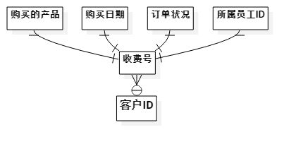

# 数据库设计

## 项目数据库

### 基本描述

项目数据库存储了所有和项目有关的信息。具体的说来，它有如下信息：

- 订单号
- 订单所属员工
- 客户联络点
- 客户账单地址
- 购买的产品
- 日期
- 订单状况（{已完成|未完成|被取消}）

### 项目分析

#### E-R图

### 数据库设计

先建立一个项目数据库(`projects`)。

再建立两个表单：

1. 客户信息表(`customers`)
2. 订单信息表(`orders`)

客户信息表中有如下项：

- **客户ID**
- 联络点
- 账单地址

订单信息表中有如下项：

- 客户ID
- **收费号**
- 购买的产品
- 购买日期
- 订单状况

## 考勤数据库

### 基本描述

考勤数据库存储了所有和考勤卡(`time card`)相关的信息。具体的说来，它有如下信息：

- 员工ID
- 考勤卡ID
- 工时上限
- 收费号
- 工时

### 项目分析

#### E-R图

### 数据库设计

先建立一个考勤数据库(`attendance`)。

再建立两个表单：

1. 员工考勤(`workers`)
2. 考勤卡(`time_cards`)

员工考勤表中有如下项：

- 员工ID
- **考勤卡ID**
- 工时上限

考勤卡表中有如下项：

- **考勤卡ID**
- 收费号
- 日期
- 总工时